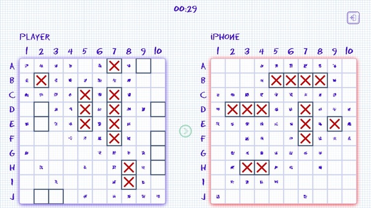
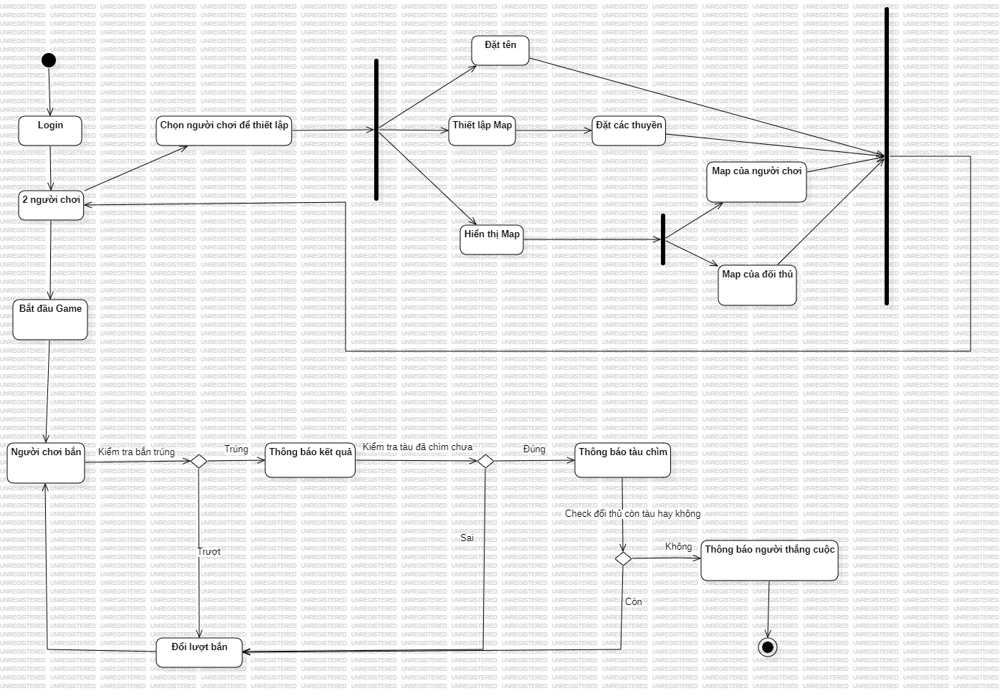
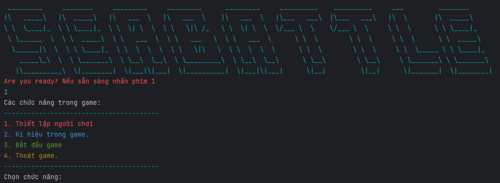
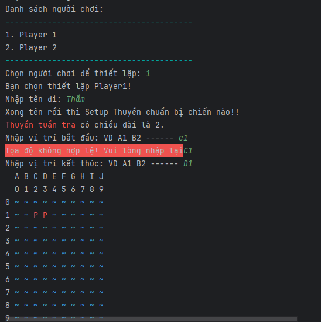
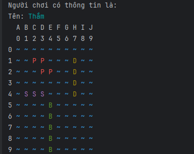
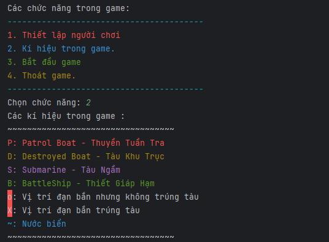
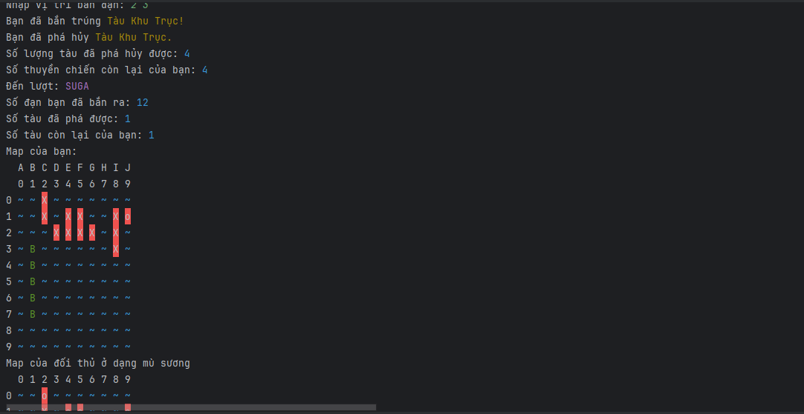
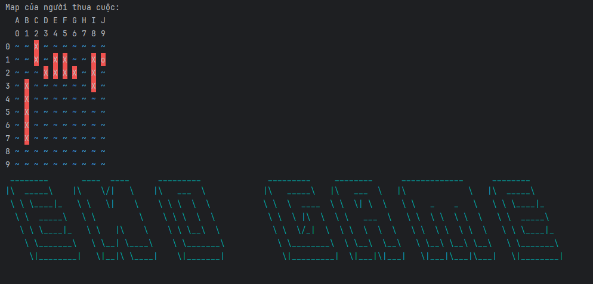

# Sea Battle

Sea Battle là một trò chơi dành cho hai người chơi. Trò chơi được chơi trên bốn lưới, hai cho mỗi người chơi. Các lưới thường là vuông - thường là 10 × 10 - và các ô riêng lẻ trong lưới được xác định bằng chữ cái và số. Trên một lưới, người chơi sắp xếp các tàu và ghi lại các phát bắn của đối thủ. Trên lưới còn lại, người chơi ghi lại các phát bắn của riêng mình.

Dự án được hiện bởi [Phan Thị Hồng Thắm](https://github.com/thm1911), trong quá trình Lập trình hướng đối tượng tại [ProPTIT](https://proptit.com/).

#### 📝 Vòng chuẩn bị
- Ban đầu, người chơi được cho 1 bảng 10x10, một cột đánh từ A->J, một cột đánh từ 1->10. Mỗi người chơi sở hữu 5 con thuyền như sau:
    - 2 Thuyền Tuần Tra (Patrol Boat) 1x2
    - 1 Tàu Khu Trục (Destroyer Boat) 1x4
    - 1 Tàu Ngầm (Submarine) 1x3
    - 1 Thiết Giáp Hạm (Battle Ship) 1x5


- Người chơi sẽ có thể nhập vào 2 toạ độ (X,Y) với từng mẫu thuyền để đặt thuyền, màn hình sẽ hiển thị thuyền lên bảng. Sau khi đặt xong hết, sẽ sang lượt đặt của người kia.

#### 📝 Luật trò chơi
- 1 tàu sẽ bị phá huỷ chỉ sau khi toàn bộ điểm bị phá hết. ví dụ tàu 1x5 thì ít nhất 5 phát bắn trúng đích toàn bộ để phá
- Khi bên nào bị phá hết tàu trước lập tức thua cuộc và - hiển thị màn hình kết quả, bảng của cả 2 bên

## Tech Stack
- [Java](https://www.java.com/en/)
## Software Design (UML)
**Class Diagram**


**Activity Diagram**



## Video demo

- [Video demo](https://youtu.be/xyxJ8Omr1dY?si=E3tFDyho1N5-JHhC)

## Ảnh Demo













## Cấu trúc folder

```bash

├── branch develop
│   ├── Phan Thị Hồng Thắm
│   │   ├── Product
|   |   |   ├── src
|   |   |   |   ├── main
|   |   |   |   |   ├── java
|   |   |   |   |   │   ├── controller
│   │   │   ├── README.md
│   │   │   ├── image.png
│   │   │   └── ...
│   │   ├── UML
│   │   │   ├── README.md
│   │   │   ├── image.png
│   │   │   └── ...
│   │   ├── README.md
│   │   └── ...
│   ├── README.md
```


### Yêu cầu sản phẩm
- Là một người chơi, tôi có thể vào game và bắt đầu chơi. Sẽ có hai người chơi trong một ván game và lượt sẽ được luân phiên.


### [YÊU CẦU SẢN PHẨM CUỐI]
#### MVP VERSION (Minimum viable product) - Chức năng buộc phải có


    - Menu mới bắt đầu có thể bắt đầu game
    - Vòng chuẩn bị, đủ các loại tàu, bảng 10x10, có thể đặt tàu
    - Vòng chơi, luân phiên lượt, có thể bắn qua lại với nhau, xem các lựa chọn như yêu cầu
    - Có điều kiện kết thúc game
    - Việc đặt tàu, bắn tàu (các công đoạn nhập liệu) bên trên có thể cho phép happy case (giả định người dùng không nhập ra ngoài, nhập tàu không chồng lấn nhau) và không cần xác minh
---
#### Chức năng có thể làm thêm (Sau khi hoàn thành MVP) - Không bắt buộc


##### Độ khó ⭐
- Cơ chế kiểm tra khi nhập liệu cần kiểm tra không cho đặt tàu chồng lấn, đặt tàu ngoài vùng, bắn điểm ngoài vùng, bắn điểm đã bắn, ...
- Hiển thị giao diện bảng rõ ràng, có thể dùng emoji, kí tự đặc biệt, ...
- Output màn hình hiển thị menu, bảng của hai bên có thể in ra màu (https://www.geeksforgeeks.org/how-to-print-colored-text.../), có thể hiển thị vùng bị bắn rồi, chỗ tàu bị nổ, ... rõ ràng và đẹp hơn

##### Độ khó ⭐⭐
- Chế độ tự động đặt tàu ngẫu nhiên ở vòng chuẩn bị
- Thêm tính năng bảng xếp hạng số lượt bắn ít nhất, số tàu còn lại của người chơi khi thắng, Lúc này khi vào game cần nhập thêm tên người chơi để lưu lại, ở menu ban đầu có thể chọn hiển thị bảng xếp hạng

##### Độ khó ⭐⭐⭐
- Cho phép chơi với máy ở menu bắt đầu, máy tự động đặt thuyền, và bắn ngẫu nhiên, biết chơi greedy như tập trung bắn nốt 1 tàu khi đã bắn trúng được 1 điểm
- Thêm tính năng lưu trạng thái của game để chơi tiếp khi thoát, trạng thái của 1 game bao gồm trạng thái bảng của 2 người chơi, lượt hiện tại, .. Sau đó ở menu ban đầu có thể chọn load game để chơi tiếp
- Cơ chế vẽ bảng dynamic, cho phép truyền vào 1 số để có bảng là hình vuông từ 10x10 đến 20x20, mọi tính năng vẫn chạy tốt


# SeaBattle---Java
